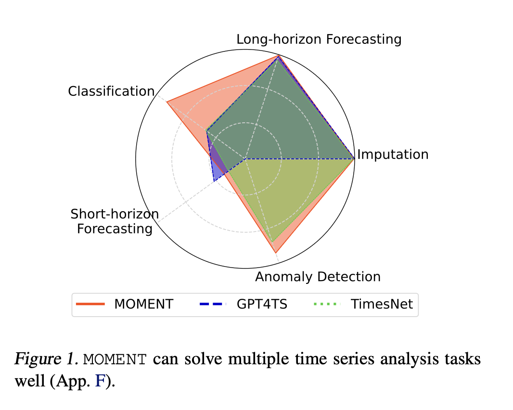

# Prompt-Infused Masked Autoencoder for Nonstationary Time-Series Short-Term Forecasting in Healthcare

  

## Slide 1 – Title
**Prompt-Infused Masked Autoencoder for Nonstationary Time-Series Short-Term Forecasting in Healthcare**  
- Extension of MOMENT framework  
- Focus: healthcare short-term forecasting (real-time critical)  
- Datasets: USR & UEA medical/healthcare  

---

## Slide 2 – Research Topic
- Domain: Healthcare time-series (ECG, EEG, vitals)  
- Task: **Short-term forecasting** to anticipate immediate patient condition changes  
- Baseline models: MOMENT, GPT4TS, TimesNet  
- Goal: Improve **real-time forecasting** with a **prompt-infused autoencoder**  

---

## Slide 3 – Current Issues
- **Nonstationarity**: signals shift quickly due to patient activity/condition  
- **Noise**: sensor readings are irregular and corrupted in real-world data  
- **Real-time requirement**: existing models are often too slow or unstable  
- **Interpretability gap**: clinicians need understandable forecasts for action  

---

## Slide 4 – Proposed Solution
- Extend **MOMENT** backbone with **prompt embeddings**  
- Use **adaptive masking** for fast-changing healthcare signals  
- Encode **medical prior knowledge** (e.g., rhythms, vital sign ranges) via prompts  
- Generate **prompt-guided forecasts** for both accuracy and interpretability  

---

## Slide 5 – Implementation Plan
- Integrate **prompt module** into MOMENT for short-term forecasting  
- Train & evaluate on **USR + UEA healthcare datasets**  
- Compare with baselines: MOMENT, GPT4TS, TimesNet  
- Evaluation metrics:  
  - Forecasting accuracy (**MAE, RMSE**)  
  - Robustness in **real-time performance** (latency, throughput)  
  - Interpretability (visual attention maps for forecast rationale)  

---

## Slide 6 – Expected Outputs
- A **novel prompt-based short-term forecasting model** for healthcare  
- Robust to **nonstationary & noisy patient signals**  
- Supports **real-time decision making** in clinical environments  
- Competitive or superior accuracy vs. state-of-the-art  
- First application of **prompt-infused MOMENT in healthcare short-term forecasting**  